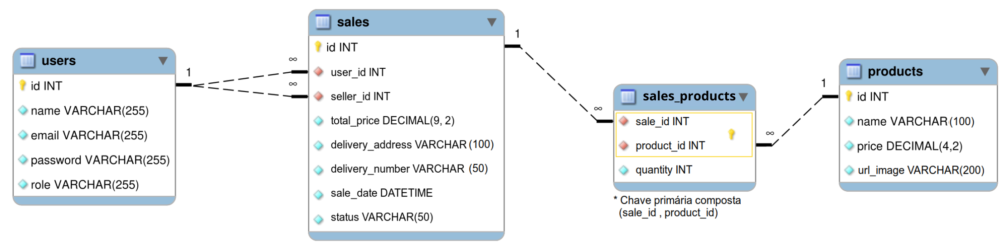

# Projeto Delivery APP(Monorepo)

Projeto em grupo realizado durante módulo de Back-end do curso de desenvolvimento web da Trybe.

  
<strong>O que foi feito</strong>
 

Neste projeto em grupo criamos e integramos tanto o back-end quanto o front-end, criando uma plataforma de delivery de cerveja.

Nesta aplicação, é possível fazer a comunicação entre clientes e pessoas vendedoras: a pessoa cliente faz o pedido via "carrinho de compras" e a pessoa vendedora aprova, prepara e envia esse pedido. Quando o produto é recebido por quem comprou, essa pessoa marca o pedido como "recebido". Ambos possuem detalhes sobre seus pedidos.

Para facilitar o entendimento, podemos dividir a aplicação em 4 fluxos principais, uma validação de status entre cliente e pessoa vendedora e cobertura de testes (front-end e back-end):

Fluxo Comum que possui:

    (1) Tela de Login;
    (2) Tela de Registro;

Fluxo do Cliente que possui:

    (3) Tela de Produtos;
    (4) Tela de Checkout;
    (5) Tela de Pedidos;
    (6) Tela de Detalhes do Pedido;

Fluxo da Pessoa Vendedora que possui:

    (7) Tela de Pedidos;
    (8) Tela de Detalhes/Controle do Pedido;

Validação do Status do Pedido que possui:

    (9) Teste de status sem atualização em tempo real;
    (10) Teste de status com atualização em tempo real;

Fluxo da Pessoa Administradora que possui:

    (11) Tela de gerenciamento de usuários;

Fluxo da Pessoa Vendedora que possui:

    (12) Testes de cobertura.

  A aplicação foi desenvolvida com:

- `Node.js`
- `Javascript`
- `Sequelize`
- `Arquitetura MSC`
- `Express`;
- `MySql`;

[Diagrama de ER](./assets/erdr.png) conforme imagem:

  
<strong>Como rodar o projeto</strong>
 

 Configurações mínimas para execução do projeto:

- Sistema Operacional Distribuição Unix
- Node versão 16.14.0 LTS

**Localmente:**

**Necessita ter um banco de dados(MySql) instalado localmente**

- `npm install` na raiz do projeto;
- `npm run dev` na raiz do projeto;
- `localhost:3000` no browser;

  
<strong>:memo: Tecnologias utilizadas</strong>
 
  
- `Node.js`
- `Javascript`
- `Sequelize`
- `Arquitetura MSC`
- `Express`;
- `MySql`;

  
<strong>:memo: Habilidades</strong>
 

- A aderência do código à especificação. O app deve se comportar como especificado no repositório, no protótipo e no Diagrama de ER disponível no projeto;
- A organização do seu código e a arquitetura geral da aplicação (tanto da API quando do front-end);
- A aderência ao padrão REST na API;
- O respeito a estrutura do banco de dados. A implementação não deve adicionar ou remover tabelas, campos ou relacionamentos e a API deve estar preparada para aproveitar essa estrutura por completo;
- A cobertura de testes. Seu código deve ser testável e possuir uma suíte de testes unitários e/ou de integração robusta e com alta cobertura.
- A aderência aos princípios SOLID;

  
<strong>Devs responsáveis</strong>

- [@FP-Coding](https://github.com/FP-Coding)
- [@isaacost](https://github.com/isaacost)
- [@laisOmena](https://github.com/laisOmena)
- [@Murilo-MRS](https://github.com/Murilo-MRS)

<!-- Olá, Tryber!
Esse é apenas um arquivo inicial para o README do seu projeto.
É essencial que você preencha esse documento por conta própria, ok?
Não deixe de usar nossas dicas de escrita de README de projetos, e deixe sua criatividade brilhar!
:warning: IMPORTANTE: você precisa deixar nítido:
- quais arquivos/pastas foram desenvolvidos por você; 
- quais arquivos/pastas foram desenvolvidos por outra pessoa estudante;
- quais arquivos/pastas foram desenvolvidos pela Trybe.
-->